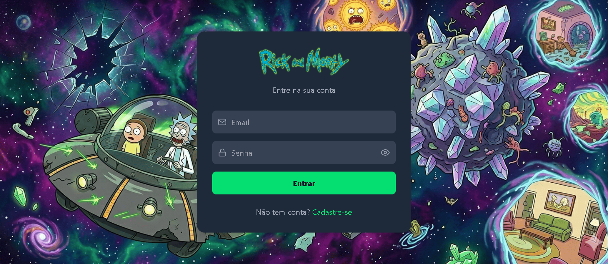
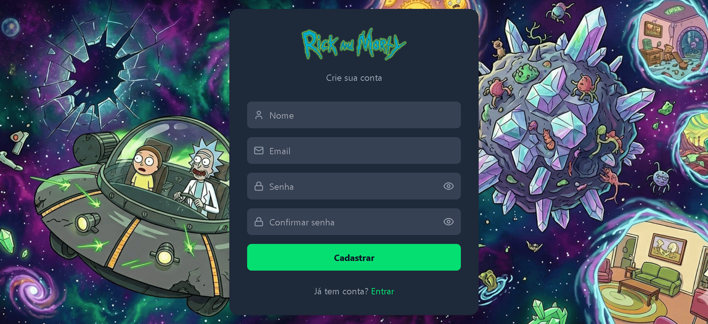
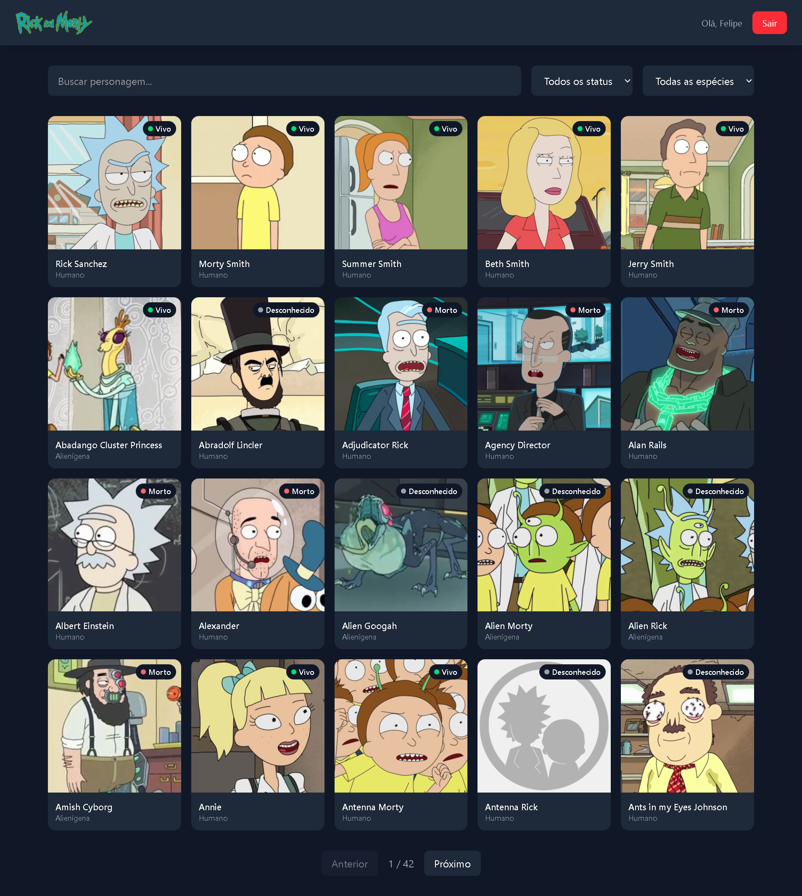
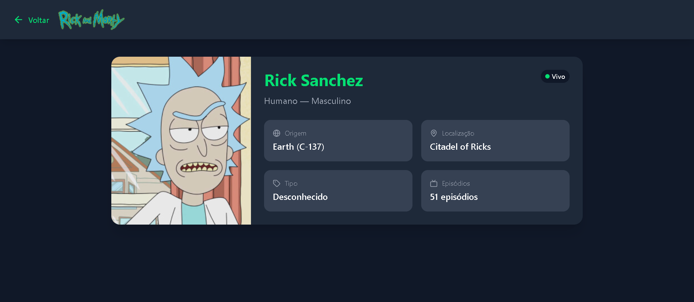

# 🌌 Mundo Rick and Morty

Aplicação web desenvolvida como desafio técnico frontend, consumindo a [Rick and Morty API](https://rickandmortyapi.com) para listar e explorar personagens do universo Rick and Morty.

## 📸 Screenshots

### Login


### Cadastro


### Listagem de Personagens


### Detalhe do Personagem


## 🚀 Tecnologias utilizadas

- **React** com Vite
- **React Router DOM** — roteamento e rotas protegidas
- **Context API** — gerenciamento de estado de autenticação
- **Axios** — requisições HTTP
- **React Hook Form + Zod** — formulários e validações
- **Tailwind CSS** — estilização e responsividade
- **Lucide React** — biblioteca de ícones moderna https://lucide.dev/icons
- **Jest + React Testing Library** — testes unitários
- **GitHub Actions** — CI/CD automatizado
- **Docker + Nginx** — containerização da aplicação
- **Storybook** — documentação visual de componentes

## 💡 Decisões técnicas

- **React** foi escolhido por ser o framework que tenho mais familiaridade e domínio, com curva de aprendizado mais leve e amplamente usado no mercado
- **Context API** foi escolhido no lugar do Redux por ser suficiente para o escopo do projeto, sem overhead desnecessário
- **Zod** foi escolhido para validação de schemas por ter ótima integração com React Hook Form
- **Tailwind CSS** foi escolhido pela agilidade na criação de layouts responsivos
- **Jest** foi escolhido por ser o padrão do ecossistema React para testes unitários
- **Docker** com Nginx foi escolhido para facilitar a execução em qualquer ambiente

## ✅ Funcionalidades implementadas

- Tela de Login com validação de campos e feedback de erro
- Mostrar/ocultar senha no login e cadastro
- Tela de Cadastro com validação e confirmação de senha
- Feedback visual de sucesso ao cadastrar conta
- Autenticação simulada com localStorage
- Rotas protegidas — usuário não autenticado é redirecionado ao login
- Listagem de personagens com paginação
- Busca de personagens com debounce
- Filtro por status (Vivo/Morto/Desconhecido)
- Filtro por espécie
- Tela de detalhe do personagem
- Tradução dos dados da API para português
- Layout responsivo para desktop e mobile
- Componentização reutilizável (CharacterCard, StatusBadge, Input)
- Tratamento de erros e loading states nas chamadas de API
- Lazy loading de rotas para melhor performance
- Acessibilidade (ARIA, navegação por teclado, labels, contraste)

## 🏆 Diferenciais implementados

- Testes unitários com Jest + React Testing Library
- CI/CD com GitHub Actions (roda lint e testes a cada push)
- Docker + Nginx para containerização
- Storybook para documentação visual dos componentes
- Lazy loading de rotas (code splitting)
- Acessibilidade (aria-label, aria-invalid, aria-describedby, role)
- Debounce na busca para otimização de requisições
- Commits atômicos seguindo Conventional Commits

## 🤖 Uso de Inteligência Artificial

Este projeto foi desenvolvido com auxílio do Claude (Anthropic).

**O que foi auxiliado por IA:**
- Implementação do AuthContext com localStorage
- Configuração das rotas protegidas com React Router
- Estilização dos componentes com Tailwind
- Implementação do debounce para busca
- Componentização (CharacterCard, StatusBadge, Input)
- Configuração do Jest e testes unitários
- Configuração do GitHub Actions
- Configuração do Docker e Nginx
- Configuração do Storybook e stories dos componentes
- Implementação de acessibilidade (ARIA)

**O que foi compreendido e aprendido no processo:**
- Como funciona o fluxo de autenticação simulada com Context API
- Como proteger rotas com React Router v6
- Como usar React Hook Form com Zod para validação
- Como usar forwardRef em componentes reutilizáveis
- Como funciona o debounce para otimizar buscas
- Como escrever testes unitários com Jest e React Testing Library
- Como configurar CI/CD com GitHub Actions
- Como containerizar uma aplicação React com Docker e Nginx
- Como documentar componentes com Storybook
- Como aplicar acessibilidade em formulários

## 📁 Estrutura do projeto
```text
src/
│   App.jsx
│   index.css
│   main.jsx
│
├───assets/
│       FundoRickMorty.png
│       LogoRickMorty.png
│
├───components/
│       CharacterCard.jsx
│       CharacterCard.stories.jsx
│       Input.jsx
│       Input.stories.jsx
│       StatusBadge.jsx
│       StatusBadge.stories.jsx
│
├───contexts/
│       AuthContext.jsx
│
├───hooks/
│       useDebounce.js
│
├───pages/
│       CharacterDetail.jsx
│       Characters.jsx
│       Login.jsx
│       Register.jsx
│
├───routes/
│       AppRoutes.jsx
│
└───services/
        api.js
```

## 📦 Como rodar o projeto
```bash
# Clone o repositório
git clone https://github.com/felipefrotadf/mundo-rick-and-morty.git

# Entre na pasta
cd mundo-rick-and-morty

# Instale as dependências
npm install

# Rode o projeto
npm run dev
```

Acesse **http://localhost:5173** no navegador.

## 🧪 Como rodar os testes
```bash
npm test
```

## 📖 Como rodar o Storybook
```bash
npm run storybook
```

Acesse **http://localhost:6006** no navegador.

## 🐳 Como rodar com Docker
```bash
# Build da imagem
docker build -t mundo-rick-and-morty .

# Rodar o container
docker run -p 8080:80 mundo-rick-and-morty
```

Acesse **http://localhost:8080** no navegador.

## 📱 Telas da aplicação

- `/login` — Tela de login
- `/register` — Tela de cadastro
- `/characters` — Listagem de personagens (protegida)
- `/characters/:id` — Detalhe do personagem (protegida)